> （题图：出题时使用过的草稿纸）

距离 12 月 25 日 RIC “小锐的冬季魔法” 活动结束，也过去几天了。作为本次活动 PIC（负责人）之一及主要出题人，我想把自己出题的思路放在这里，以作参考。

:::note[注意]
本文并不是解析。正式活动的内容（题目、答案、解析、答对人数及名次等），见 <a href="https://ricwph.eseabs0.icu/" target="_blank" rel="noopener noreferrer">活动网页</a>。
:::

# 写在前面

这次出题时的主要思路/前提：

- **从港大/香港生活产生灵感，但不强行产生联系。** 虽然 RIC 这个组织和大家的港大/香港生活有很强的关联性，如果有契合这个主题也非常好，但是强行扯关系也不合适。最终的 7 道题目来看，Q1-5 是确实与港大生活有关的，也算是有契合主题了。
- **宁可偏难，用提示降低难度，不出过于简单的题。** 这是为了避免解谜变成纯粹的 “拼手速” 大赛。（当时并未预见到参与人数的问题。现在看，或许劝退了好多人……）
- **预设回答者会使用搜索引擎。** 这一条在 Q2、Q4 等需要一定背景知识的题目里很有用。
- **保证每一条信息都是有用的。** 也就是说，不为了提高难度，加入无效信息。

另外，一个小巧思： **Q1-6 的答案都是圣诞礼物的词，Q7 则是 FATHER XMAS（Father Christmas，圣诞老人）。** 

# Q1

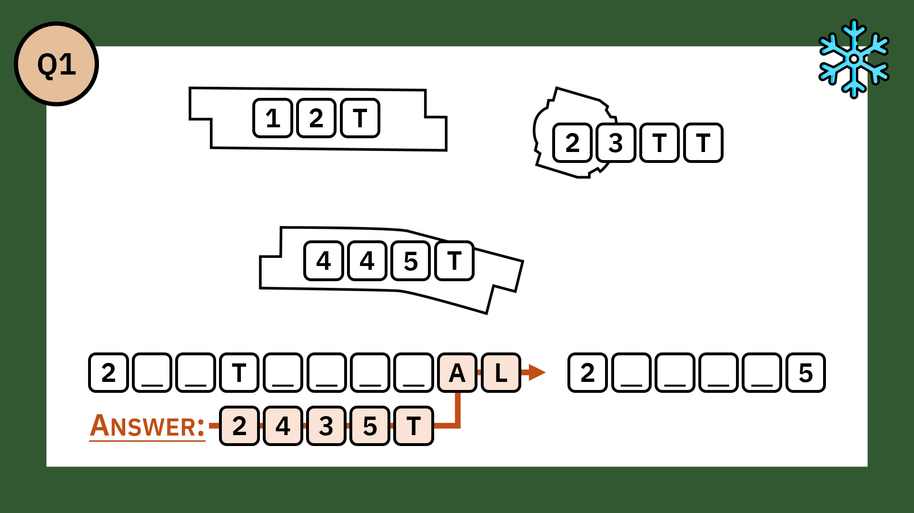

Q1 是最先想到的。

灵感：从港大的教学楼入手——百周年的三栋楼都以 "Tower" 结尾，所以都可以得到以 T 结尾的缩写（JCT、CYTT、RRST）。

原本的地图是提示 3 和解析里那样的完整地图。为了适当上调难度（前提 1），去掉了背景的灰色部分。

遗憾：实际上，百周年校园三栋教学楼正式的缩写是 CJT、CCT、CRT，但是这样不方便出题（结果就是造出了 CYTT 这个并没有实际使用例子的缩写（

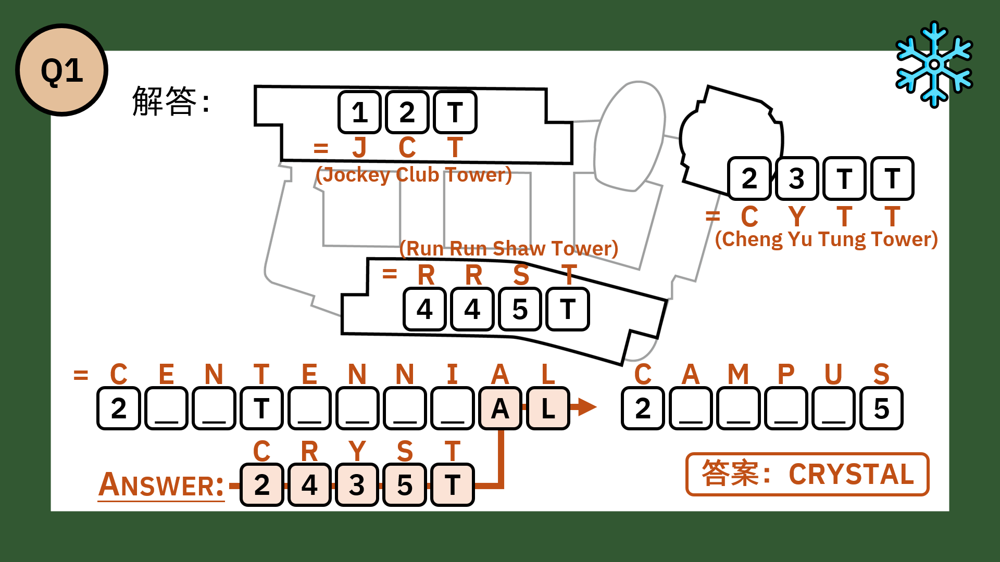

# Q2

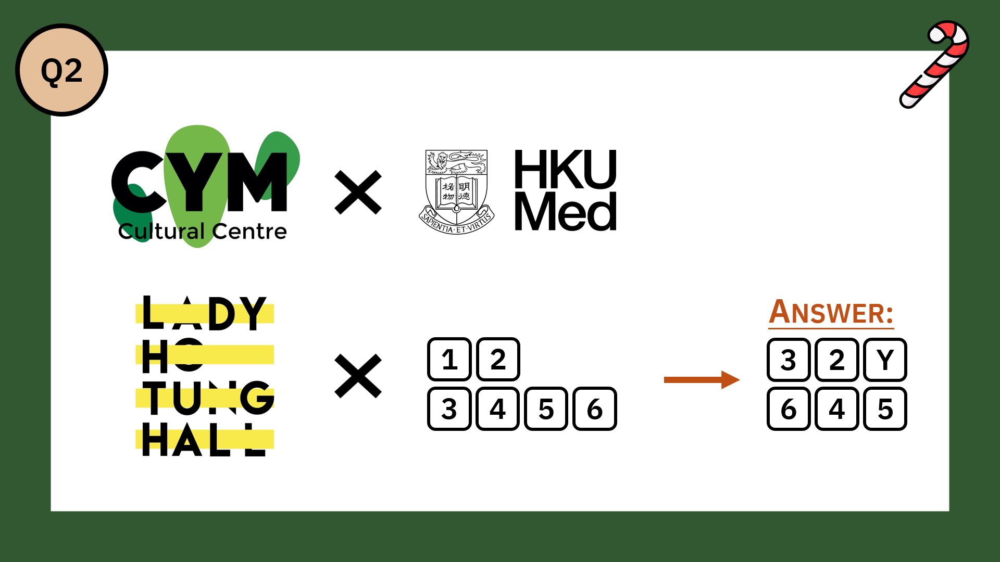

灵感：Q2 一开始使用的是生物学里的遗传图解（LKS × CYM 夫妻，RR -- RM 兄弟）。

但是在庄友试题的过程中，发现并不是每个人都能 get 到这一点（教育背景、学科不同，且不属于容易搜索到的背景知识）。

同时，兄弟这一点显得没有什么用，像无效信息，所以删掉了（前提 4）。

这一题我很喜欢的点，在于每一个题给建筑都找到了官方的 logo，构图还蛮整齐的 :-D 。

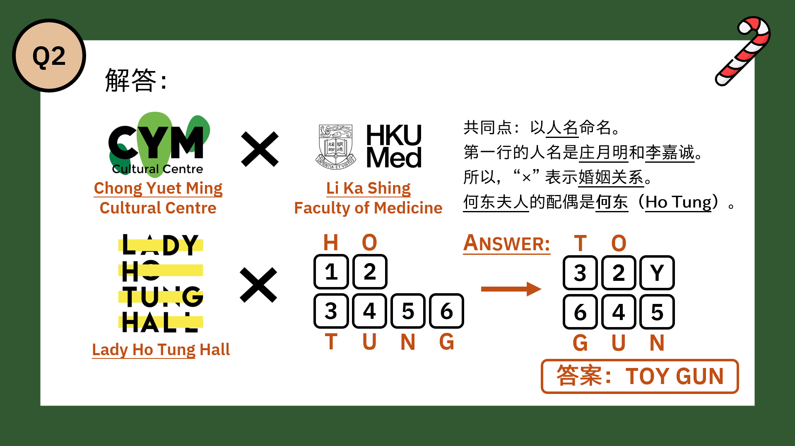

# Q3

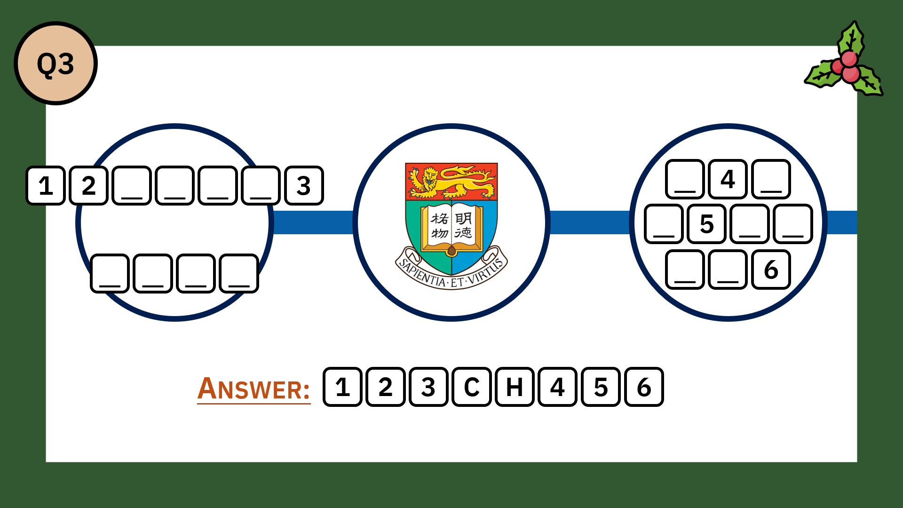

Q3 也是一开始就有想好的题目之一。

本来的想法是港铁线路图更大的一部分；后来为了简洁和港大相关性，就只选取了港岛线的一端。

同时，如果足够细心的话，可以发现 “坚尼地城”（Kennedy Town）的那一边是断开的，表示是终点站（提示 2）。

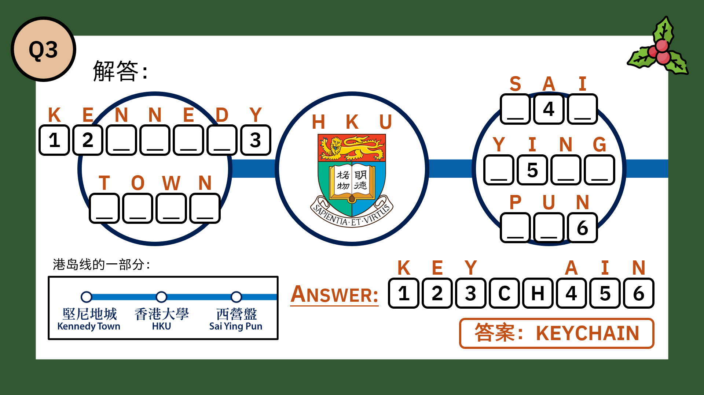

# Q4

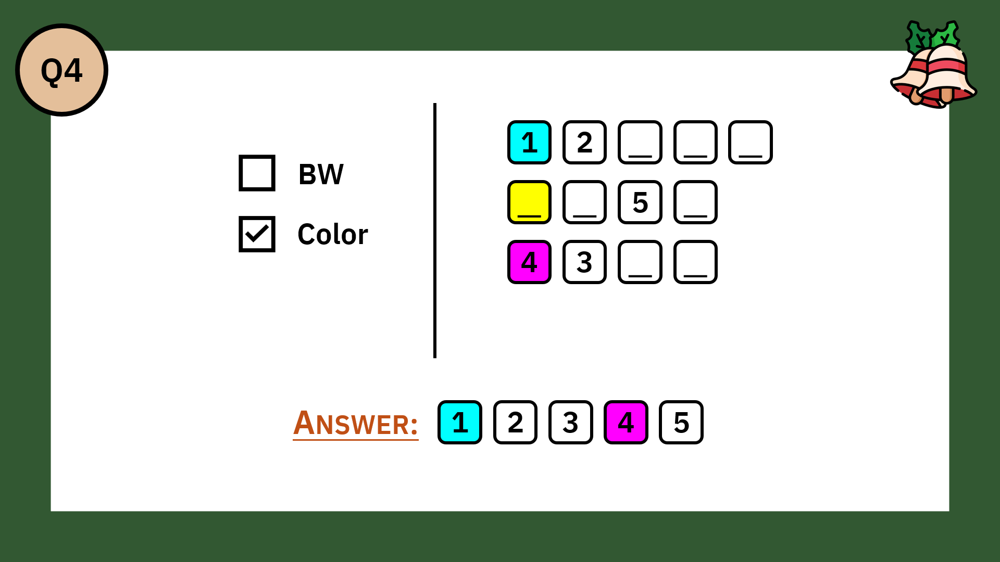

Q4 灵感来自：

::link{url="https://www.xiaohongshu.com/discovery/item/691b6dd1000000000d03c3a9?source=webshare&xhsshare=pc_web&xsec_token=AB88UsBtokbcM3YXjiPxjqigdo0Tz0NIEqC5mSMVA_nto=&xsec_source=pc_share"}

虽然但是，这是这次最少人答对的题了（隐藏题不算）（（

遗憾：从 CMYK 容易使人想到要放进颜色名，要先填 CYM，后推导出 Chong Yuet Ming 的提示有点不足；而且 CYM 已经用第二次了，不太合适。

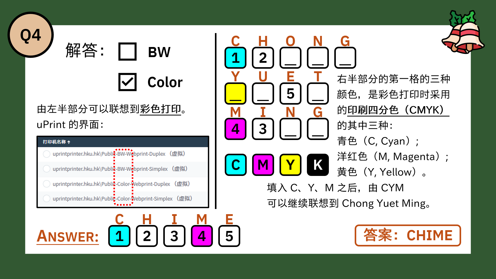

# Q5

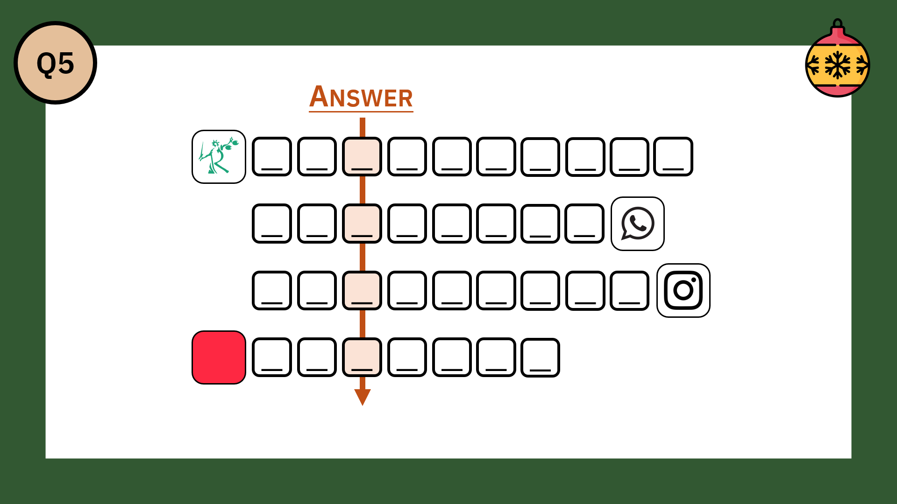

Q5 灵感来自庄友 csh（另一位 PIC），感谢！我在她所出原题的基础上引入了反向填入 App 名字和 RIC Grocery 两点。

遗憾：为了凑三个提示，前两个就显得很……低智……（

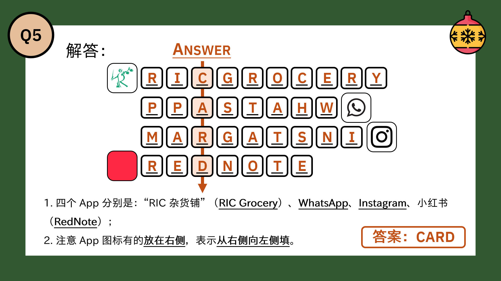

# Q6

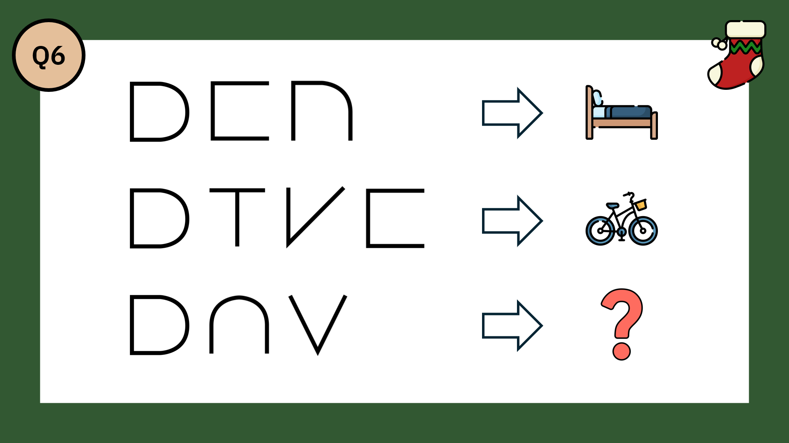

Q6 灵感是某天突然出现的（笑）。

题图里的草稿纸就是画这些字母留下的。

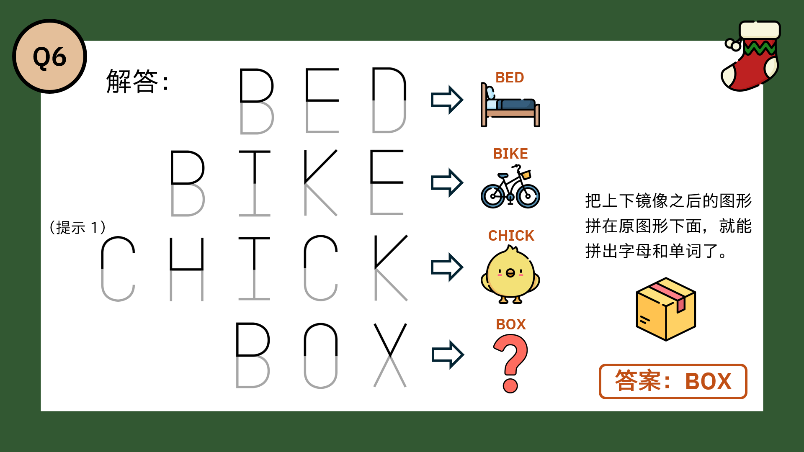

# Q7

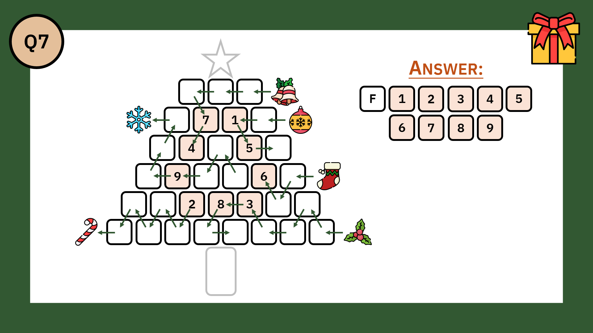

Q7 要做元谜题（metapuzzle）的想法是到整个命题过程中间才出现的，并非一般采用的先出元谜题后出其他题的方式，所以个人感觉不太 “美观”。

不过，想到要出元谜题时就想好了要用圣诞树的形状，所以前 6 题的答案（BOX、CARD、CHIME、TOYGUN、CRYSTAL、KEYCHAIN）的字母数（3, 4, 5, 6, 7, 8）是设计好的。

用右上角的图案来提示前几题的答案这件事倒是蛮后面才想到的，所以紧急把所有图的格式都调整成了那样（笑）。

这道题一大半的出题过程是在期末的 CBC（Chow Yei Ching Bldg LG/F）的白板上完成的。同时，感谢庄友 ssz 给了可以预先给一个字母（F）的灵感！

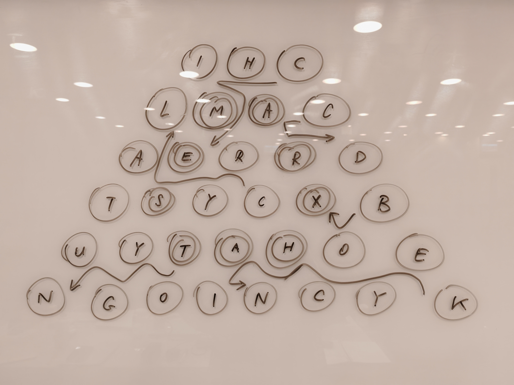

> （图：CBC 的白板）

同时，出题过程中也 Google 了 "Christmas word 10 letters" 这样的关键词，发现这种网络资源不少（理由不明（

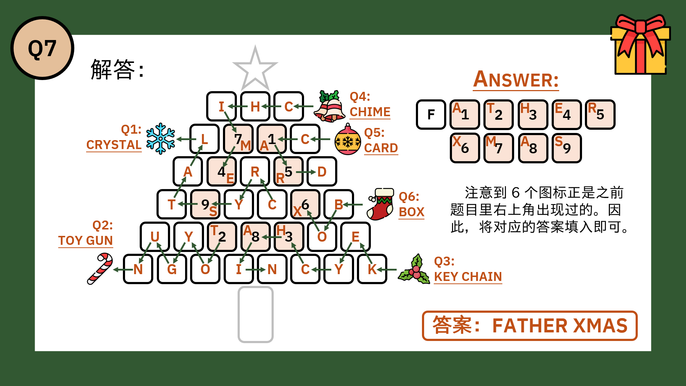

# 后记

出题形式（包括填方格、元谜题）的主要灵感来源是小红书 @鱼左谜题站，是很有意思的谜题博主！个人主页的链接如下：

::link{url="https://xhslink.com/m/9W7xDdZHSIr/" title="鱼左谜题站 - 小红书"}

（虽然这些应该是 Puzzle Hunt 很常用的手段 (?)，但是我是从这里学的/doge）

感谢各位庄友在谜题灵感、难度测试中提供的协助，以及感谢庄友 wxp 制作的活动网页。

同时，也要感谢所有点进网页参与的同学们。

技术部分，7 道题目及其提示、解析一共有 35 张图片，是使用 Powerpoint 设计制作的。

每题图片右上角的图案来自 Flaticon 中的 Lineal color by Freepik。Flaticon - Icons 的链接如下：

::link{url="https://www.flaticon.com/icons" title="Flaticon - Icons" description="Vector icons - SVG, PSD, PNG, EPS & Icon Font - Thousands of free icons"}

能构造出符合谜题的词，也很感谢 Deepseek、Gemini、Poe Assistant 等人工智能助手（排名不分先后（x 