作为一个很喜欢收集各种东西（某种意义上的 “集邮”）的人，一年到头，自然要看一下这一年集了点什么东西 /doge

:::important[注意]
如无特别说明，“今年” 指 2025 年。
:::

# 1. 港铁 “车站大亨” MTR Station Master

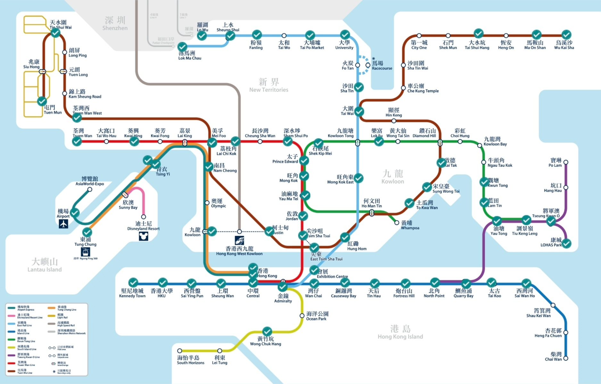

> "MTR Moblie" App > “所有工具” > “MTR 分奖赏计划” > “徽章” > “车站大亨” > “检视全部” > “路线图”

截至 2025 年 12 月 31 日，完成进度 61 / 98。

# 2. 10 个集邮局的图案邮戳 A Set of 10 Pictorial Postmarks

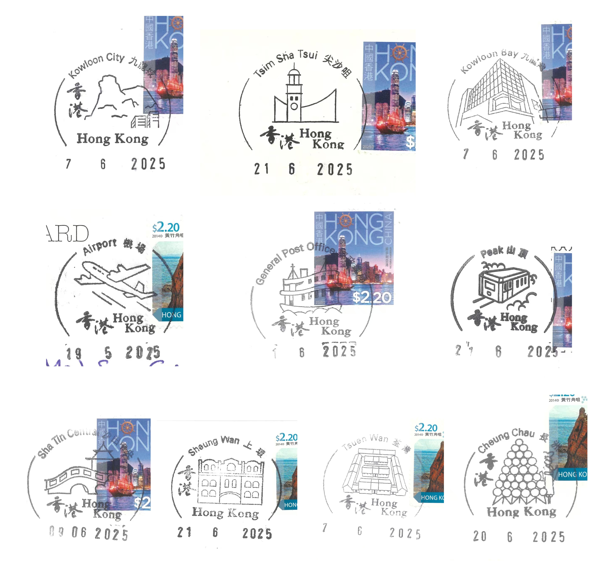

6 月发现有这个东西以后就用几个周末去集邮了（跑了很远 顺便也收集到了 MTR 车站 hh

10 个集邮局：

- 中环邮政总局 General Post Office (GPO)
- 山顶邮政局 Peak Post Office (PEK)
- 九龙城邮政局 Kowloon City Post Office (KCY)
- 长洲邮政局 Cheung Chau Post Office (CCU)
- 尖沙咀邮政局 Tsim Sha Tsui Post Office (TST)
- 机场邮政局 Airport Post Office (APT)
- 荃湾邮政局 Tsuen Wan Post Office (TSW)
- 沙田中央邮政局 Sha Tin Central Post Office (SCL)
- 上环邮政局 Sheung Wan Post Office (SWN)
- 九龙湾邮政局 Kowloon Bay Post Office (KBY)

顺便放一下在中环邮政总局集的 “2025 年香港通用邮票” 纪念印！

> 表格是自己设计的。

# 3. 飞行 Flights

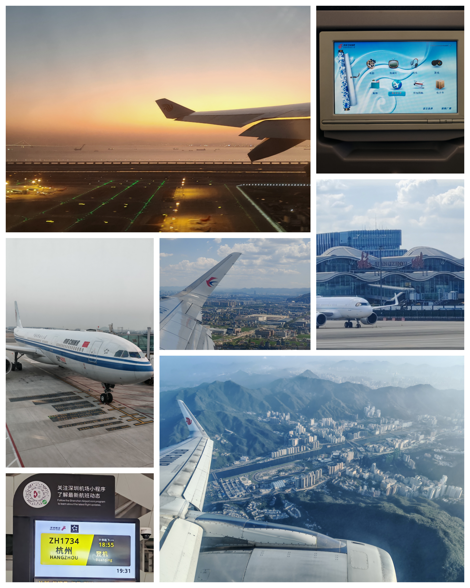

> 除夕傍晚的跑道（01/28）；12.9 岁的 A330 屏幕（01/19）；\
> 国航的第 50 架 A330（01/19）；东航的翼尖小翼和萧山地面（08/29）；HGH 的 “杭州” 大字；\
> 深圳机场的显示屏（12/23）；俯瞰沙田区：马场、城门河（10/17）

- 01/19 CA1737 HGH - SZX
- 01/28 CA1734 SZX - HGH
- 02/05 CA727 HGH - HKG
- 08/29 MU595 HGH - HKG
- 10/12 ZH9957 SZX - KWE
- 10/15 CA1780 KWE - HGH
- 10/17 CA727 HGH - HKG
- 12/23 CA1734 SZX - HGH

以及今年的 4 个机场：

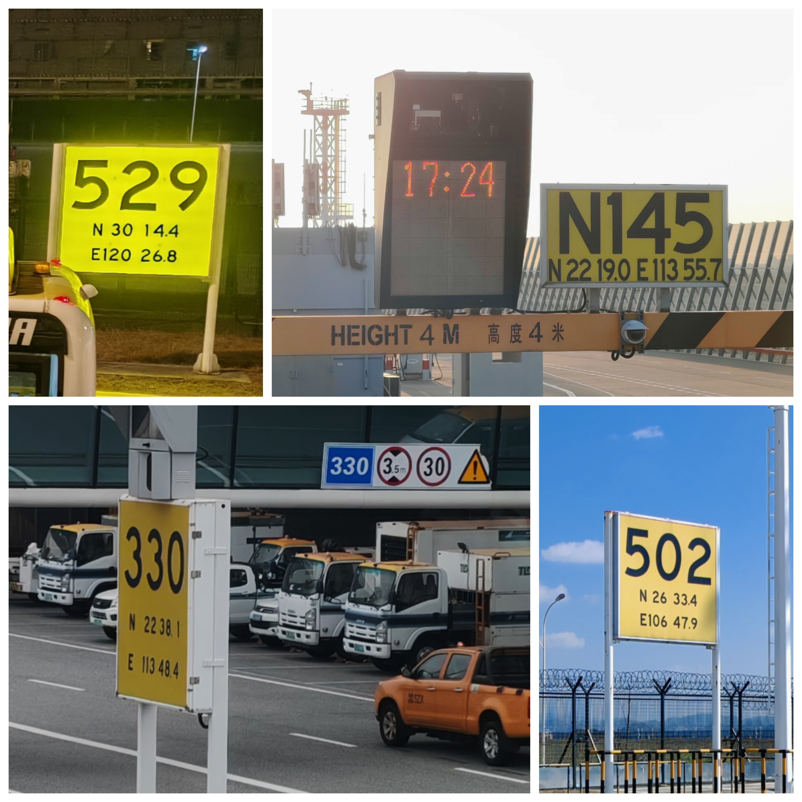

> 杭州萧山（HGH）；香港（HKG）；\
> 深圳宝安（SZX）；贵阳龙洞堡（KWE）

# 4. 铁道 Railway

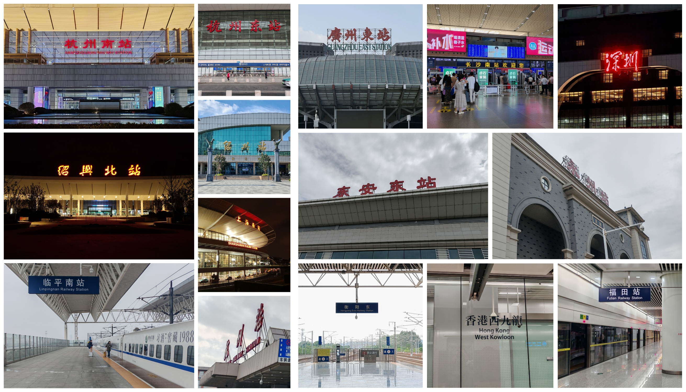

- 01/19 G5857 福田 - 香港西九龙
- 01/31 G1344 杭州东 - 临平南 D3141 临平南 - 杭州南
- 04/03 C8014 深圳 - 广州东
- 04/05 G6513 广州南 - 深圳北
- 05/01 G5606 香港西九龙 - 福田
- 07/05 C636 宁波 - 余姚 - 上虞 - 绍兴 G7526 绍兴北 - 杭州东
- 07/11 C402 杭州 - 上海南
- 07/12 G7553 上海南 - 杭州东
- 07/14 G461 杭州东 - 长沙南 G537 长沙南 - 东安东
- 07/23 G1506 东安东 - 永州
- 07/24 G2339 永州 - 东安东
- 07/29 D3968 东安东 - 衡阳东 G882 衡阳东 - 长沙南
- 07/31 G404 长沙南 - 杭州东

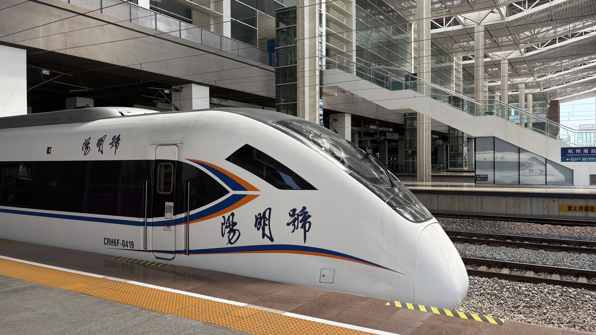

> 绍兴城际 “阳明号”（07/05）

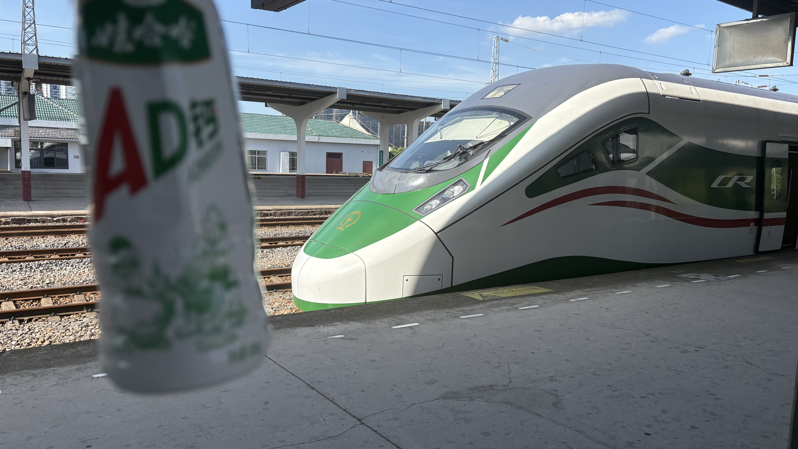

> AD 钙奶和 “AD 钙奶” CR200J（07/05，C636）

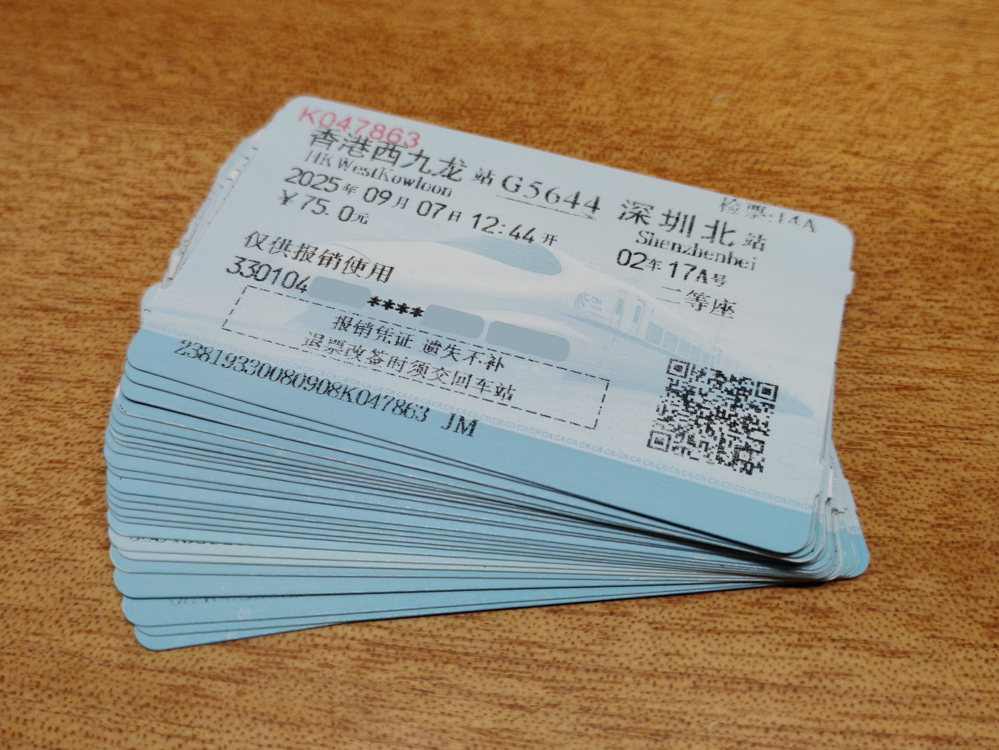

值得一提的是，今年 9 月 30 日之后，纸质报销凭证全面停用。图中的厚厚一叠，正式成为了历史。

# 5. 出入境管制站 Control Points

今年集齐了香港的所有陆路管制站[^1]发出的入境标签（“小白条”）。

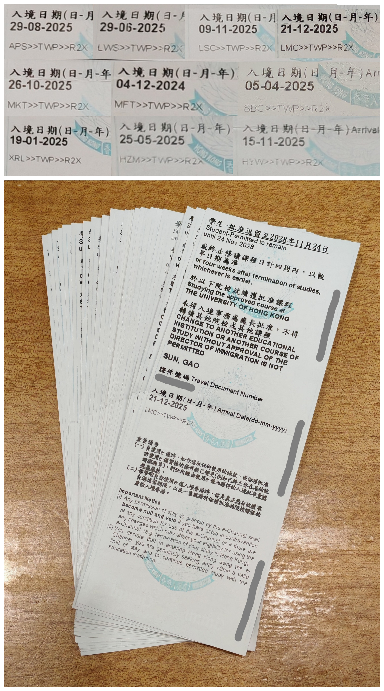

香港的所有陆路管制站[^1]：
- 罗湖 Lo Wu (LWS)
- 落马洲 Lok Ma Chau (LMC)
- 落马洲支线 Lok Ma Chau Spur Line (LSC)
- 文锦渡 Man Kam To (MKT)
- 深圳湾 Shenzhen Bay (SBC)
- 高铁西九龙 Express Rail Link West Kowloon (XRL)
- 港珠澳大桥 Hong Kong-Zhuhai-Macao Bridge (HZM)
- 香园围 Heung Yuen Wai (HYW)

以及两个其他的（航空、水路）：
- 香港国际机场 Hong Kong International Airport (APS)
- 港澳客轮码头 Macao Ferry Terminal (MFT)

[^1]: 除暂停通关的沙头角（Sha Tau Kok）。

# 6. 捐血 Blood Donation

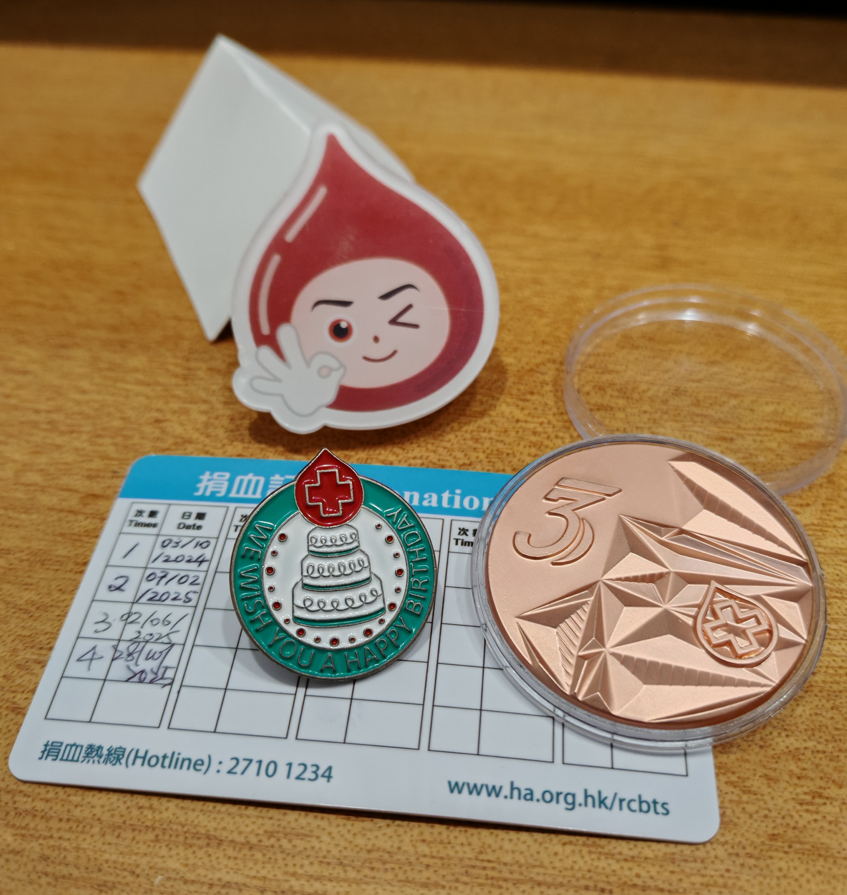

> “捐血队长” “青少年捐血章” “生日纪念章” 及捐血记录

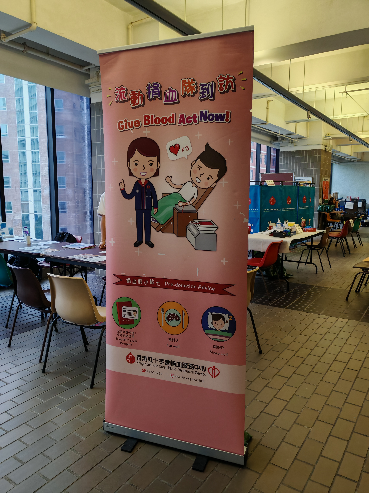

> K. K. Leung Concourse, G/F, K. K. Leung Building 梁銶琚楼地下公共空间

今年捐了三次血！第三次是在学校的流动捐血队捐的；甚至刚好是生日月，所以获得了 “生日纪念章”。

（PS 听说底下这张实体的捐血卡已经绝版了 hh）

# 写在后面

本文的图片，除了 “4. 铁道 Railway” 中的 train-stations.jpg 中 “广州东站” 图源网络，其余均为自己拍摄/扫描/制作。

拖了三天（）的集邮文终于写好啦！新的一年也要去想去的地方，看想看的风景，做想做的事！🎉