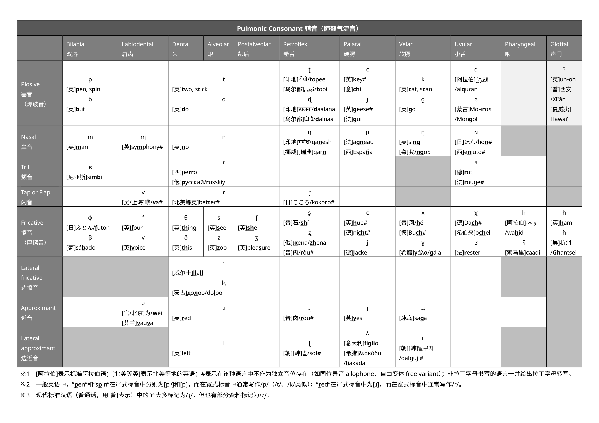
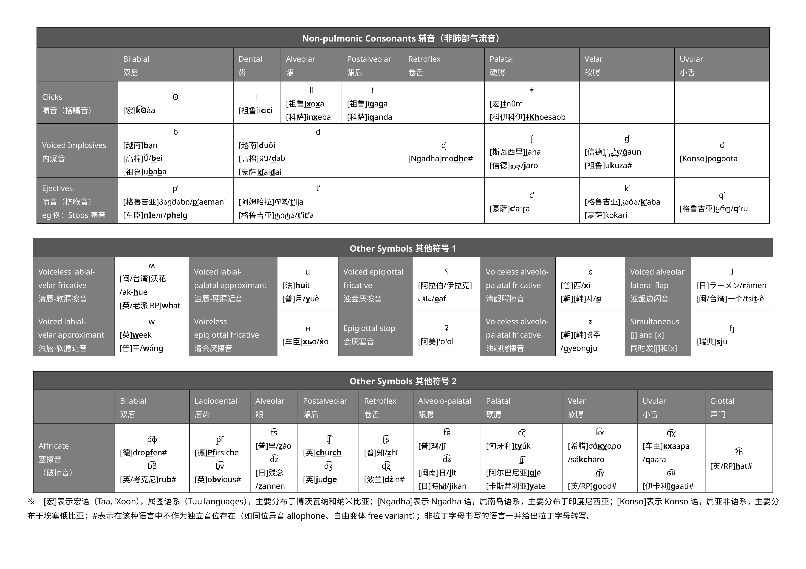
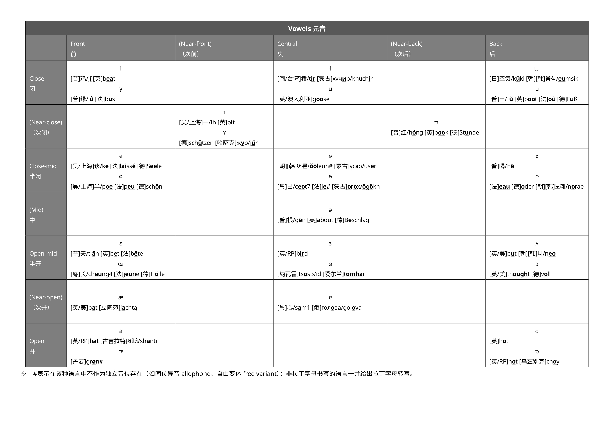

# 写在前面

语音学（Phonetics）学习中，常常用到国际音标（International Phonetic Alphabet，IPA）。

之前上 **LING2004 Phonetics: Describing sounds** (2024-25 Sem 2) 的时候，为了方便自己记忆 IPA，手搓了一张 IPA 对应常见语言音素表。

当时的这张表只包含了辅音里的肺部气流音（pulmonic consonants）。现在把这张表搬上来，同时扩充到整个国际音标表。

# 说明

制作这张表的原则简述如下：

1. 符号、表格格式等，均参照国际语音学学会（International Phonetic Association）的国际音标表（即题图，最后修订于 2015 年）。

2. 例词的选取上，整体按照以下原则：

    - 优先选择中国人较为熟悉的汉语族诸语言和其他使用者多的语言；

    - 优先选择被视作 “标准语” 的语言变体（例：现代标准汉语、标准阿拉伯语）。

　

# 辅音（肺部气流音）Pulmonic Consonants

# 辅音（非肺部气流音）及其他符号 Non-pulmonic Consonants & Other Symbols

# 元音 Vowels

# 参考及补充资料 References and Additional Materials

::link{url="https://www.bilibili.com/video/BV1vg411w7he" title="【IPA】国际音标发音示范（2021版）" description="哔哩哔哩 bilibili"}

::link{url="https://www.internationalphoneticassociation.org/IPAcharts/IPA_charts_EI/IPA_charts_EI.html" title="Interactive IPA Chart" description="International Phonetic Association | ɪntəˈnæʃənəl fəˈnɛtɪk əsoʊsiˈeɪʃn"}

::link{url="https://zh.wikipedia.org/wiki/%E6%9C%89%E8%81%B2%E5%9C%8B%E9%9A%9B%E9%9F%B3%E6%A8%99%E8%82%BA%E9%83%A8%E6%B0%A3%E6%B5%81%E9%9F%B3%E8%A1%A8" title="有声国际音标肺部气流音表" description="维基百科，自由的百科全书"}

::link{url="https://zh.wikipedia.org/wiki/%E6%9C%89%E5%A3%B0%E5%9B%BD%E9%99%85%E9%9F%B3%E6%A0%87%E5%85%83%E9%9F%B3%E8%A1%A8" title="有声国际音标元音表" description="维基百科，自由的百科全书"}