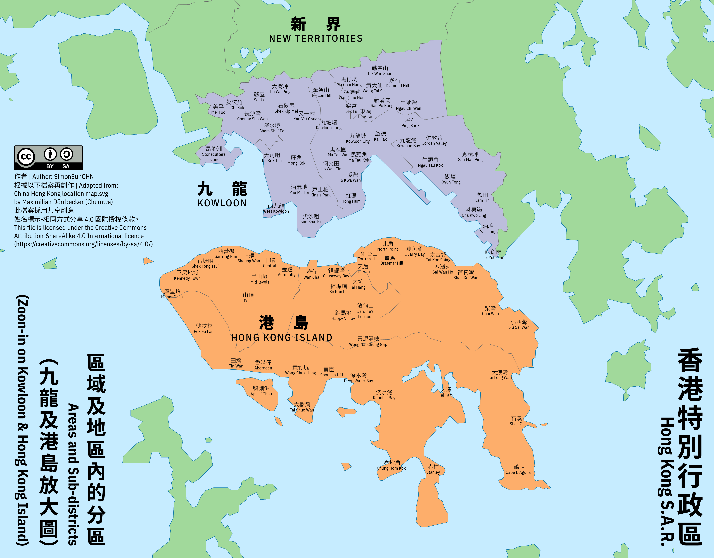

:::note[説明]
本文標題和正文以外文本的字體，在部分設備上看起來可能會有些奇怪，或是「參差不齊」。這是因為這篇文章的語言設定為「zh-HK」（香港繁體），而非網頁其他部分的「zh-CN」（內地/大陸簡體）。
:::

把前段時間空的時候搓的地圖放上來。

# （題圖）區議會「十八區」

香港特別行政區 - 區議會「十八區」\
（HKSAR - The 18 Districts of the District Councils）

設色：綠色為新界；紫色為九龍；橙色為港島。

# 區域及地區内的分區

香港特別行政區 - 區域及地區内的分區\
（HKSAR - Areas and Sub-districts）

香港特別行政區 - 區域及地區内的分區（九龍及港島放大圖）\
（HKSAR - Areas and Sub-districts (Zoom-in on Kln & HKI)）

# 其他

- 軟體：Adobe Illustrator 2024

- 字體：（中文）Noto Sans HK、Noto Serif HK；（西文）IBM Plex Sans Condensed

# 參考

- 地圖：

    - China Hong Kong location map.svg，作者：Maximilian Dörrbecker (Chumwa)，取自[File: China Hong Kong location map.svg - Wikimedia Commons](https://commons.wikimedia.org/wiki/File:China_Hong_Kong_location_map.svg)（原共享創意授權條款：CC BY-SA 3.0 Unported）；

- 地區内的分區：

    - 名稱之選錄主要參考：[《各區域及地區》（AREAS AND DISTRICTS）](https://www.rvd.gov.hk/doc/tc/hkpr15/06.pdf)，香港特別行政區政府差餉物業估價署（Rating and Valuation Department）；

    - 除上表中名稱之外，也參考 [OpenStreetMap](https://www.openstreetmap.org/) 酌情增加一些，同時以之確定地名標注的位置；

    - 此外，也參考了 [香港地方列表 - 維基百科，自由的百科全書](https://zh.wikipedia.org/zh-hk/%E9%A6%99%E6%B8%AF%E5%9C%B0%E6%96%B9%E5%88%97%E8%A1%A8)；以及：

    - 《e香港街》香港特別行政區政府地政總署測繪處（Survey and Mapping Office, Lands Department），可在此處下載：[地政總署 - e香港街](https://www.landsd.gov.hk/tc/resources/mapping-information/ehkg.html)。

:::important[注意]
1. 本文所收三張圖片檔案，其共享創意授權條款均是按圖中所示之 **[CC BY-SA 4.0](https://creativecommons.org/licenses/by-sa/4.0/)**，而非網頁其他部分的 CC BY-NC-SA 4.0。這是出於三張圖片是在他人作品基礎上再創作的原因。
2. 地區内的分區名稱未能盡收，且其標注位置僅供參考。
:::